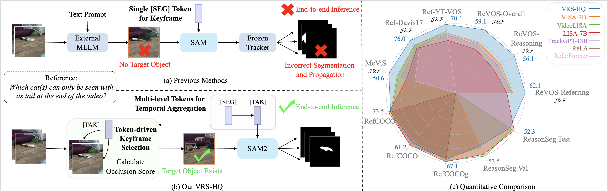
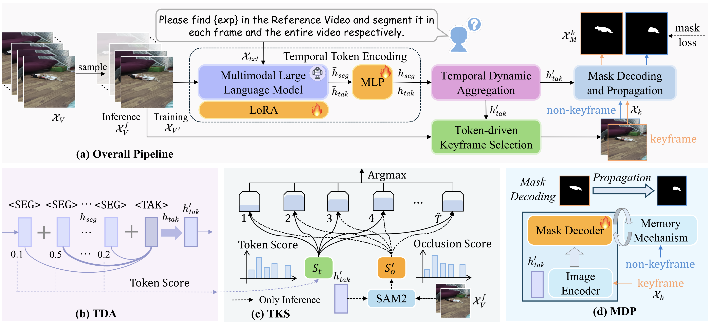

# VRS-HQ

<!-- <font size=7><div align='center' >
[](https://github.com/cilinyan/VISA)
[](https://arxiv.org/pdf/2501.08549)
[](https://github.com/cilinyan/ReVOS-api)
</div></font> -->
Official code for "The Devil is in Temporal Token: High Quality Video Reasoning Segmentation" CVPR 2025! <span>&#x1F389;</span>

[](https://paperswithcode.com/sota/referring-video-object-segmentation-on-revos?p=the-devil-is-in-temporal-token-high-quality)
[](https://paperswithcode.com/sota/referring-video-object-segmentation-on-mevis?p=the-devil-is-in-temporal-token-high-quality)
[](https://paperswithcode.com/sota/referring-expression-segmentation-on-refer-1?p=the-devil-is-in-temporal-token-high-quality)

## <span>&#x1F525;</span> Our Approach
### Motivation
Comparison with previous VRS approaches. (a) Previous methods utilize a single &lt;SEG&gt; token for keyframe-based segmentation, depending heavily on external models for keyframe detection and mask propagation. This reliance can hinder accurate keyframe localization and prevent end-to-end inference. (b) VRS-HQ introduces frame-level &lt;SEG&gt; and a temporal &lt;TAK&gt; token for dynamic aggregation. The aggregated &lt;TAK&gt; token is then used for both keyframe selection and mask generation within SAM2. This enables single-stage inference with precise keyframe selection and high-quality segmentation. (c) VRS-HQ achieves state-of-the-art performance on various image and video datasets across reasoning and referring segmentation.
<div align=center>

</div>

### Overall Pipeline
(a) VRS-HQ architecture. VRS-HQ incorporates a Multimodal Large Language Model for Temporal Token Encoding (&lt;SEG&gt; and &lt;TAK&gt; tokens), a Temporal Dynamic Aggregation, a Token-driven Keyframe Selection and Mask Decoding and Propogation. (b) Temporal Dynamic Aggregation (TDA) merges frame-level &lt;SEG&gt; tokens into a temporal &lt;TAK&gt; token using a weighted fusion based on cosine similarity. (c) Token-driven Keyframe Selection (TKS). During training, the frame with the &lt;SEG&gt; token closest to the &lt;TAK&gt; token is selected as the keyframe. During inference, keyframe selection is refined using SAM2's occlusion scores and token similarity scores. (d) Mask Decoding and Propagation (MDP). The &lt;TAK&gt; token provides a sparse embedding for SAM2, generating a keyframe mask and propagating it to other frames via a memory mechanism.
<div align=center>

</div>

### Performance
We provide the results based on Chat-UniVi-7B, demonstrating the effectiveness of our proposed method.
|      **Model**       | **MLLM** |      **Referring (J&F)** | **Reasoning (J&F)** | **Overall (J&F)** |
| :------------------: | :----------: | :-----------------: | :----------------: | :---------------: |
|   VISA    |     Chat-UniVi-7B    |            50.9          |       43.0        |       46.9        |
|   VISA   |      Chat-UniVi-13B      |        57.4        |       44.3        |       50.9        |
| VRS-HQ |      Chat-UniVi-7B    |        62.1         |        56.1       |       59.1        |
## 🛠️ Getting Started

### Dataset Preparation
Please follow the [VISA](https://github.com/cilinyan/VISA) project to download the corresponding image and video datasets. Our data file structure for training and inference will remain consistent with theirs.

### Pretrained Weights

#### Training 
First, download the pretrained weights of SAM2 (hiera_large) by running: 
```bash
cd checkpoints
bash download_ckpts.sh
```

Second, download the pretrained weights of [Chat-UniVi](https://github.com/PKU-YuanGroup/Chat-UniVi). 

Third, download the weights of [CLIP-336](https://huggingface.co/openai/clip-vit-large-patch14-336) for keyframe selection during inference.

#### Inference
We provide the model weights based on Chat-UniVi-7B on the Huggingface and Baidu Drive respectively:
[Huggingface](https://huggingface.co/SitongGong/VRS-HQ)/[Baidu Drive](https://pan.baidu.com/s/1YO5BwNx8fXxWTDCgllx1kw?pwd=74j4)


### Installation
```shell
conda create -n vrshq python=3.10 -y
conda activate vrshq
git clone https://github.com/SitongGong/VRS-HQ
cd VRS-HQ
pip install -e .
# For Chat-UniVi
pip install transformers==4.31.0
```

### Validation
Updating
#### Running VRSHQ to generate masks
You only need to rectify some configurations and filepath in the evaluation code. 
```bash
# For ReVOS
CUDA_VISIBLE_DEVICES='0' deepspeed --master_port=24999 evaluation_multiseg.py \
    --val_dataset "revos_valid" \
    --log_base_dir "/18515601223/segment-anything-2/rvos_results" \
    --exp_name "evaluation_revos" \
```

#### Using tools to calculate the metrics


<details open>
<summary> <strong>📑 Todo list</strong> </summary>
  
- [ <span>&#x2705;</span> ] Release inference code

- [ <span>&#x2705;</span> ] Release the model weights of VRS-HQ

- [ ] Release training code

</details>

## <span>&#x1F31F;</span> Cite

If you find this project useful in your research, please consider citing:

```
@article{gong2025devil,
        title={The Devil is in Temporal Token: High Quality Video Reasoning Segmentation},
        author={Gong, Sitong and Zhuge, Yunzhi and Zhang, Lu and Yang, Zongxin and Zhang, Pingping and Lu, Huchuan},
        journal={arXiv preprint arXiv:2501.08549},
        year={2025}
        }
```

## 🎖️ Acknowledgement
This work is built upon the [Chat-UniVi](https://github.com/PKU-YuanGroup/Chat-UniVi), [VISA](https://github.com/cilinyan/VISA) and [SAM2](https://github.com/facebookresearch/segment-anything-2).
We sincerely thank these excellent contributions..

